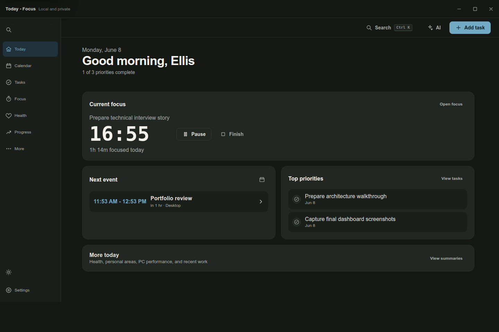

# Focus

Focus is a private, local-first desktop home for daily planning, focused work,
health check-ins, habits, personal progress, recent work, and reflection.



## Product

- **Today:** current focus block, next event, top priorities, health, progress,
  and recent work.
- **Focus AI:** a persistent right-side companion for typed requests that
  prepares calendar, task, and reminder changes for approval. Spoken requests
  are available with the optional OpenAI provider.
- **Calendar:** local month planning with events and reminders.
- **Tasks:** quick capture, priorities, due dates, filters, and reminders.
- **Focus:** restart-safe timer, breaks, daily goals, history, and explainable
  pattern learning.
- **Health:** lightweight sleep, energy, mood, water, movement, and notes.
- **Progress:** habits, milestone-based goals, and learning.
- **Medical organizer:** appointments, personal records, and an emergency profile encrypted at rest when a verified operating-system keyring is available.
- **Weekly review:** deterministic week-over-week analytics with an optional read-only AI narrative.
- **Daily routines:** configurable morning and evening checklists on Today.
- **Timeline:** one chronological history derived from completed work and
  personal notes.
- **Work and Insights:** recent project context and cautious local summaries.
- **Search and Settings:** keyboard command search, backups, optional sync,
  privacy controls, and appearance.
- **Personal baseline:** guided first-run capture for goals, schedule, fitness,
  nutrition, learning, focus preferences, and explicit AI permissions.

External calendar and health-provider integrations are intentionally not part of
the first release. Local planning modules work offline; Focus AI uses a local
Ollama model by default, with OpenAI available only as an explicit cloud option.

## Architecture

- Electron main process for atomic persistence, dialogs, secure credentials,
  optional AI, folder/MySQL sync, notifications, and window controls.
- Context-isolated preload API with Node integration disabled.
- ES module renderer under `src/`, split into core state, feature pages, shared
  UI, and semantic design tokens.
- Versioned v4 document schema with automatic migration from the original Focus
  Pattern Tracker state.
- Existing deterministic `focusModel.js` retained for scoring and recommendations.

Detailed reviewed plans live in [`docs/plans`](docs/plans).

## Run

```bash
npm install
npm start
```

New users are guided through a short personal baseline. Existing users are not
forced through onboarding and can reopen it from Today or Settings.

Open Settings and choose **Set up local AI** to start Ollama and provision the
default `qwen3:4b-instruct` model. Ollama must be installed in `PATH` or
`~/.local/bin/ollama`; setup never requires an OpenAI API key.

## Verify

```bash
npm run check
npm test
npm run screenshots
npm run dist
```

The screenshot command writes dark and light desktop captures to
`docs/screenshots/`. The release command builds the platform artifact under
`dist/`; signing credentials are required separately for trusted Windows and
macOS distribution.

## Privacy

Focus works without an account or network connection. Canonical state is stored
locally, backups are user initiated, and folder/MySQL sync remains optional.
Local assistant prompts stay on the computer and are sent only to Ollama's
loopback API. An optional OpenAI API key is encrypted with Electron
`safeStorage` and never enters the Focus document. Assistant changes require
approval before they reach local state. Health entries are wellness notes only,
Medical records are an organizer only: they are excluded from browser storage, sync,
exports, search, timeline, and AI. Focus does not provide medical advice, diagnosis,
emergency services, or an application lock.
