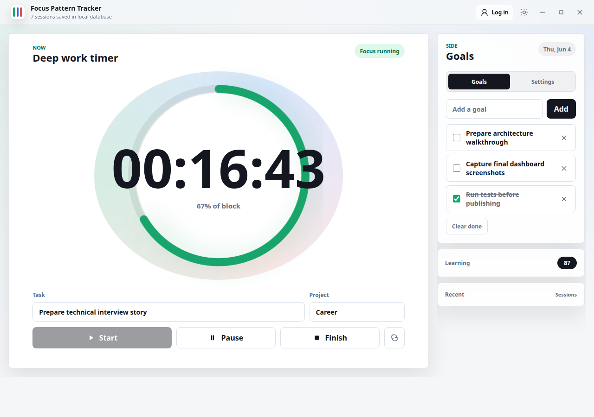

# Focus Pattern Tracker

A local-first Electron desktop app for tracking deep work, learning personal focus patterns, and planning realistic work blocks without sending productivity data to a remote AI service.


## Why This Project Stands Out

- Built a polished desktop product with vanilla Electron, HTML, CSS, and JavaScript.
- Designed an explainable local model instead of vague AI claims.
- Implemented durable local persistence, backup import/export, optional folder sync, and optional MySQL profile sync.
- Added focused Node test coverage around the model behavior that drives recommendations.
- Kept the security boundary explicit with context isolation, a narrow preload API, hashed account passwords, and no committed database credentials.

## Product Highlights

- Deep-work timer with start, pause, finish, reset, and break recommendations.
- Daily goal tracking with manual credit, remaining-time calculation, and block planning.
- Session context capture for task, project, tags, energy, focus rating, pauses, and target duration.
- Local focus fingerprint chart showing stronger and weaker hours.
- Explainable recommendations for next focus window, block length, short breaks, and long breaks.
- Recent session history with focus scores and metadata.
- Light and dark layouts with responsive fallbacks.



## Tech Stack

- Electron main/preload process for desktop shell, persistence, native dialogs, and window controls.
- Vanilla renderer code for a dependency-light UI.
- Deterministic JavaScript model in `focusModel.js`.
- Node's built-in test runner for model tests.
- Optional MySQL sync through `mysql2`.

## Quick Start

```bash
npm install
npm start
```

## Verification

```bash
npm run check
npm test
npm run screenshots
```

`npm run screenshots` writes portfolio-ready images to `docs/screenshots/` using headless Chrome.

## Optional MySQL Sync

MySQL sync is optional. Local tracking, import/export, and folder sync work without it.

```bash
cp .env.example .env
FOCUS_MYSQL_PASSWORD="replace-with-a-strong-local-password" npm run setup:mysql
```

Then enter the same database password in the app's profile menu. The app stores user account passwords as salted PBKDF2 hashes and uses Electron `safeStorage` for saved login secrets when available.

## Project Structure

```text
.
├── app.js                    # Renderer state, timer workflow, sync merge logic
├── focusModel.js             # Explainable local scoring and recommendation model
├── focusModel.test.cjs       # Model regression tests
├── main.cjs                  # Electron shell, persistence, sync, MySQL IPC
├── preload.cjs               # Narrow context-isolated bridge
├── styles.css                # Responsive desktop UI system
├── scripts/                  # MySQL setup and screenshot automation
└── docs/architecture.md      # Runtime and data-flow notes
```

## Current Status

The app is functional as a local desktop tracker and portfolio project. The highest-value next step would be packaged releases for macOS, Windows, and Linux through Electron Builder or Forge.
